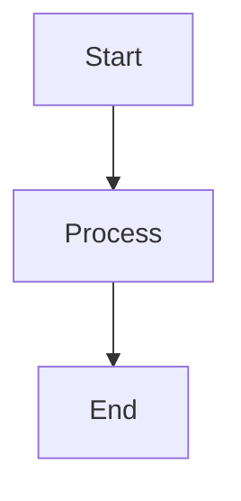

# 🎨 Physical AI Textbook - Complete Customization Guide

This guide explains how to customize every aspect of the Physical AI & Humanoid Robotics Textbook.

---

## 📋 Table of Contents

1. [Colors & Theme](#-colors--theme)
2. [Typography & Fonts](#-typography--fonts)
3. [Landing Page Design](#-landing-page-design)
4. [Chapter Content](#-chapter-content)
5. [AI Chatbot Behavior](#-ai-chatbot-behavior)
6. [Translation Settings](#-translation-settings)
7. [Personalization Logic](#-personalization-logic)
8. [Authentication Flow](#-authentication-flow)
9. [Deployment Configuration](#-deployment-configuration)

---

## 🎨 Colors & Theme

### File: `src/css/custom.css`

**Change Primary Color:**
```css
:root {
  --ifm-color-primary: #2563eb;        /* Change this blue to your color */
  --ifm-color-primary-dark: #1d4ed8;   /* Darker shade */
  --ifm-color-primary-light: #3b82f6;  /* Lighter shade */
}
```

**Change Dark Mode Colors:**
```css
[data-theme='dark'] {
  --ifm-background-color: #0f172a;     /* Background */
  --ifm-font-color-base: #e5e7eb;      /* Text color */
}
```

**Change Accent Colors:**
```css
:root {
  --accent-blue: #3b82f6;   /* Buttons, links */
  --accent-green: #22c55e;  /* Success states */
  --accent-orange: #f97316; /* Warnings */
}
```

---

## 🔤 Typography & Fonts

### File: `src/css/custom.css`

**Change Body Font:**
```css
:root {
  --ifm-font-family-base: 'Inter', sans-serif;  /* Replace with your font */
}
```

**Change Code Font:**
```css
:root {
  --ifm-font-family-monospace: 'JetBrains Mono', monospace;
}
```

**Add a New Font:**
1. Add Google Font import at top of `custom.css`:
```css
@import url('https://fonts.googleapis.com/css2?family=YourFont:wght@400;600;700&display=swap');
```
2. Update the font variable as shown above.

**Change Font Sizes:**
```css
:root {
  --ifm-font-size-base: 16px;       /* Base text size */
  --ifm-heading-font-weight: 700;   /* Heading boldness */
}
```

---

## 🏠 Landing Page Design

### File: `src/pages/index.tsx`

**Edit Hero Section:**
```tsx
// Lines ~50-80
<h1 className="hero-title">
  Your New Title Here          {/* Change title */}
</h1>
<p className="hero-subtitle">
  Your new tagline here        {/* Change subtitle */}
</p>
```

**Change Feature Cards:**
```tsx
// Look for the capabilities array
const capabilities = [
  {
    icon: "🤖",                          // Change icon
    title: "Your Feature Title",          // Change title
    description: "Feature description"    // Change description
  },
  // ... add more cards
];
```

**Edit Call-to-Action Button:**
```tsx
<a href="/docs/intro" className="cta-button">
  Your Button Text →           {/* Change button text */}
</a>
```

### File: `src/css/custom.css`

**Change Hero Background:**
```css
.hero {
  background: linear-gradient(135deg, #your-color1, #your-color2);
}
```

---

## 📖 Chapter Content

### Location: `docs/` folder

**Folder Structure:**
```
docs/
├── chapter-01-introduction/
│   ├── index.md              # Chapter intro
│   ├── what-is-physical-ai.md
│   └── ethics-and-society.md
├── chapter-02-foundations/
│   └── ...
```

**Add a New Chapter:**
1. Create folder: `docs/chapter-09-your-topic/`
2. Create `index.md`:
```markdown
---
sidebar_position: 9
---

# Chapter 9: Your Topic Title

## Learning Objectives

By the end of this chapter, you will:
- Objective 1
- Objective 2

## Introduction

Your content here...

:::info Summary
Key takeaways from this chapter.
:::

## Practice Questions

1. Question 1?
2. Question 2?
```

3. Update `sidebars.js` if needed.

**Add Code Examples:**
```markdown
```python
# Your Python code here
def example():
    return "Hello World"
```

**Add Diagrams (Mermaid):**
```markdown


---

## 🤖 AI Chatbot Behavior

### Backend: `backend/services/rag_service.py`

**Change AI Personality:**
```python
# Find the system prompt
SYSTEM_PROMPT = """
You are a friendly AI tutor for Physical AI and Robotics.

# CUSTOMIZE THESE RULES:
- Explain concepts like you're talking to a [beginner/expert]
- Use [formal/casual] language
- Include [examples/no examples] in responses
- Maximum response length: [200/500/1000] words

If something is not covered in the provided context, say:
"This topic is not covered in this textbook."
"""
```

**Change AI Model:**
```python
# In backend/config.py
GEMINI_MODEL = "gemini-2.0-flash-exp"  # Change to other Gemini models

# Options:
# - gemini-2.0-flash-exp (fastest, free)
# - gemini-1.5-pro (more capable)
# - gemini-1.5-flash (balanced)
```

**Adjust Response Length:**
```python
def get_response(question: str, context: str):
    # Add max_output_tokens
    response = model.generate_content(
        prompt,
        generation_config={
            "max_output_tokens": 500,  # Shorter or longer responses
            "temperature": 0.7         # 0 = precise, 1 = creative
        }
    )
```

### Frontend: `src/components/ChatbotWidget/ChatbotWidget.tsx`

**Change Chatbot Button:**
```tsx
// Find the floating button
<button className="chatbot-toggle">
  💬   {/* Change to any emoji or text */}
</button>
```

**Change Placeholder Text:**
```tsx
<input
  placeholder="Ask about robotics..."   // Change placeholder
/>
```

---

## 🌐 Translation Settings

### Backend: `backend/services/translation_service.py`

**Add New Language:**
```python
async def translate(content: str, target_language: str = "urdu"):
    # Change target language
    prompt = f"""
    Translate the following text to {target_language}.
    Keep technical terms in English.
    
    Text: {content}
    """
```

**Supported Languages:**
- urdu, hindi, arabic, chinese, spanish, french, german, etc.

### Frontend: `src/components/ChapterActions/ChapterActions.tsx`

**Add Language Button:**
```tsx
<button onClick={() => handleTranslate('spanish')}>
  🇪🇸 Español
</button>
<button onClick={() => handleTranslate('hindi')}>
  🇮🇳 हिंदी
</button>
```

**Change RTL for Arabic Languages:**
```tsx
// In the translation display
<div style={{ direction: isRTL ? 'rtl' : 'ltr' }}>
  {translatedContent}
</div>
```

---

## 🎯 Personalization Logic

### Backend: `backend/services/personalization_service.py`

**Change How Content Adapts:**
```python
def get_personalization_prompt(user_profile: dict):
    level = user_profile.get('experienceLevel', 'beginner')
    
    if level == 'beginner':
        return """
        Simplify this content:
        - Use everyday analogies
        - Avoid jargon
        - Add helpful examples
        """
    elif level == 'advanced':
        return """
        Enhance this content:
        - Add technical depth
        - Include mathematical formulas
        - Reference research papers
        """
```

**Add New Experience Levels:**
```python
# Add 'expert' or 'researcher' levels
elif level == 'expert':
    return """
    Provide research-level content:
    - Include citations
    - Discuss cutting-edge techniques
    - Compare different approaches
    """
```

### Frontend: `src/components/AuthModal/AuthModal.tsx`

**Change Signup Questions:**
```tsx
// Find the experience level options
<select>
  <option value="beginner">Beginner</option>
  <option value="intermediate">Intermediate</option>
  <option value="advanced">Advanced</option>
  <option value="expert">Expert/Researcher</option>  {/* Add new */}
</select>
```

**Add More Background Questions:**
```tsx
// Add new question in signup flow
<label>Your Research Area</label>
<input type="text" name="researchArea" />
```

---

## 🔐 Authentication Flow

### File: `src/components/AuthModal/AuthModal.tsx`

**Make Fields Required/Optional:**
```tsx
<input
  required={true}   // or false
  placeholder="Your Name"
/>
```

**Change What Gets Saved:**
```tsx
// In the handleSubmit function
localStorage.setItem('userProfile', JSON.stringify({
  name: formData.name,
  email: formData.email,
  experienceLevel: formData.experienceLevel,
  // Add or remove fields here
}));
```

**Skip Authentication:**
If you don't want login, remove the AuthModal from `src/theme/Root.tsx`.

---

## 🚀 Deployment Configuration

### Vercel Deployment

**File: `vercel.json`**
```json
{
  "buildCommand": "npm run build",
  "outputDirectory": "build",
  "framework": "docusaurus-2",
  "rewrites": [
    { "source": "/api/:path*", "destination": "/api/:path*" }
  ]
}
```

**Environment Variables (Vercel Dashboard):**
```
GEMINI_API_KEY=your_key_here
```

### Change Site URL

**File: `docusaurus.config.js`**
```js
module.exports = {
  url: 'https://your-domain.vercel.app',  // Your deployed URL
  baseUrl: '/',
};
```

### GitHub Pages Deployment

**File: `.github/workflows/deploy.yml`**
Edit the workflow to match your repository settings.

---

## 🔧 Quick Reference

| What to Change | File Location |
|----------------|---------------|
| Colors | `src/css/custom.css` |
| Fonts | `src/css/custom.css` |
| Landing page | `src/pages/index.tsx` |
| Chapters | `docs/chapter-XX-name/` |
| AI behavior | `backend/services/rag_service.py` |
| AI model | `backend/config.py` |
| Translation | `backend/services/translation_service.py` |
| Personalization | `backend/services/personalization_service.py` |
| Auth flow | `src/components/AuthModal/AuthModal.tsx` |
| Site config | `docusaurus.config.js` |
| Deployment | `vercel.json` |

---

## 💡 Tips

1. **Always test locally first**: Run `npm run start` before deploying.
2. **Clear browser cache** after CSS changes.
3. **Keep backups** before major changes.
4. **Use browser DevTools** (F12) to find exact CSS classes to customize.

---

## 🆘 Common Issues

**Colors not changing?**
- Check for `!important` in existing CSS
- Make sure you're editing the right theme (light/dark)

**Font not loading?**
- Verify the Google Fonts URL is correct
- Check browser console for errors

**AI responses too slow?**
- Switch to a faster Gemini model
- Reduce max_output_tokens

**Translation not working?**
- Check your GEMINI_API_KEY is set
- Verify the backend is running

---

*Last updated: December 2024*
