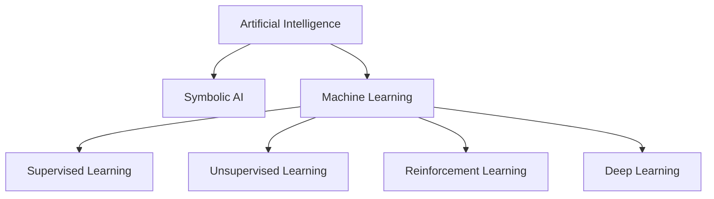
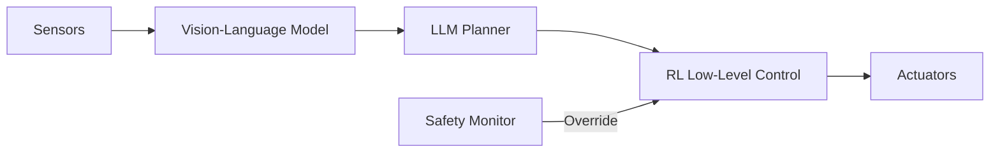

# AI Types and Approaches

import ChapterActions from '@site/src/components/ChapterActions';

<ChapterActions />

The "brain" of a robot is its AI system. Let me walk you through the different approaches to creating intelligent machines, from classic rule-based systems to modern deep learning.

## The AI Landscape for Robotics

Not all AI is created equal. For robotics, we need AI that can:
- Process sensor data in real-time
- Make decisions under uncertainty
- Learn from experience
- Operate safely in the physical world



## Symbolic AI (Good Old-Fashioned AI)

The earliest approach to AI used explicit rules and logic:

```python
# Example: Rule-based robot navigation
def navigate_to_goal(robot, goal):
    if robot.path_is_blocked():
        robot.turn_left()
    elif robot.goal_is_left():
        robot.turn_left()
    elif robot.goal_is_right():
        robot.turn_right()
    else:
        robot.move_forward()
```

### Pros
- Predictable behavior
- Easy to understand and debug
- Works well for structured environments

### Cons
- Doesn't handle uncertainty well
- Can't adapt to new situations
- Requires explicit programming of every case

### Still Used Today!
Don't dismiss symbolic AI—it's still valuable:
- Safety systems (explicit safety rules)
- High-level task planning
- Hybrid systems combining learning + rules

## Machine Learning

Instead of explicit rules, ML systems learn patterns from data:

### Supervised Learning
Learn from labeled examples:

```python
# Training a robot to recognize objects
from sklearn.ensemble import RandomForestClassifier

# Features extracted from camera images
X_train = [extract_features(img) for img in training_images]
y_train = [label for label in training_labels]

classifier = RandomForestClassifier()
classifier.fit(X_train, y_train)

# Now I can classify new objects
def identify_object(image):
    features = extract_features(image)
    return classifier.predict([features])[0]
```

**Robotics Applications:**
- Object recognition
- Speech recognition
- Gesture detection

### Unsupervised Learning
Find patterns without labels:

```python
# Clustering sensor readings to detect anomalies
from sklearn.cluster import KMeans

sensor_data = collect_sensor_readings()
clusters = KMeans(n_clusters=3).fit(sensor_data)

def detect_anomaly(reading):
    # If reading is far from all cluster centers, it's anomalous
    distances = [distance(reading, center) for center in clusters.centers_]
    return min(distances) > threshold
```

**Robotics Applications:**
- Anomaly detection
- Environment mapping
- Finding patterns in sensor data

### Reinforcement Learning
Learn by trial and error—my favorite for robotics!

```python
# Q-learning for robot navigation
import numpy as np

# Q-table: states x actions -> expected rewards
Q = np.zeros((num_states, num_actions))

def learn_episode():
    state = env.reset()
    done = False
    
    while not done:
        # Explore or exploit
        if random.random() < epsilon:
            action = random.choice(actions)
        else:
            action = np.argmax(Q[state])
        
        next_state, reward, done = env.step(action)
        
        # Update Q-value
        Q[state, action] += alpha * (
            reward + gamma * np.max(Q[next_state]) - Q[state, action]
        )
        
        state = next_state
```

**Robotics Applications:**
- Robot walking (learn optimal gait)
- Manipulation (learn to grasp)
- Navigation (learn efficient paths)

## Deep Learning

Neural networks with many layers—the technology behind most modern AI:

### Why Deep Learning Works for Robots

1. **Feature Learning** - Automatically learns useful representations
2. **Scalability** - Performance improves with more data
3. **Flexibility** - Same architecture works for vision, language, control

### Convolutional Neural Networks (CNNs)
Perfect for processing images:

```python
import torch.nn as nn

class RobotVisionCNN(nn.Module):
    def __init__(self):
        super().__init__()
        # I stack convolution layers to extract features
        self.features = nn.Sequential(
            nn.Conv2d(3, 32, kernel_size=3, padding=1),
            nn.ReLU(),
            nn.MaxPool2d(2),
            nn.Conv2d(32, 64, kernel_size=3, padding=1),
            nn.ReLU(),
            nn.MaxPool2d(2),
        )
        self.classifier = nn.Linear(64 * 56 * 56, 10)
    
    def forward(self, x):
        x = self.features(x)
        x = x.view(x.size(0), -1)
        return self.classifier(x)
```

### Transformers
The architecture behind ChatGPT—now coming to robotics:

**How they're used:**
- **Language** - Understanding voice commands
- **Vision** - Vision Transformers (ViT) for scene understanding
- **Planning** - Generating action sequences

### Imitation Learning
Learn by watching demonstrations:

```python
# Behavioral cloning - supervised learning on expert demos
def collect_demonstrations():
    demonstrations = []
    for episode in range(num_episodes):
        state = env.reset()
        expert_actions = expert.get_trajectory(state)
        demonstrations.append((state, expert_actions))
    return demonstrations

def train_imitation_policy(demonstrations):
    policy = NeuralNetwork()
    for state, action in demonstrations:
        predicted_action = policy(state)
        loss = mse_loss(predicted_action, action)
        loss.backward()
        optimizer.step()
    return policy
```

## Foundation Models for Robotics

The latest breakthrough: using large pre-trained models:

### Vision-Language Models (VLMs)
Combine visual and language understanding:
- **CLIP** - Match images to text descriptions
- **GPT-4V** - Visual reasoning and planning
- **PaLM-E** - Google's embodied multimodal model

### Large Language Models (LLMs)
Using language models for robot reasoning:

```python
# Using an LLM for task planning
prompt = """
You are a household robot. The user asked you to make coffee.
The kitchen has: coffee machine, mugs in cabinet, water tap.
Generate a step-by-step plan:
"""

plan = llm.generate(prompt)
# Output: 1. Navigate to cabinet 2. Open cabinet 3. Pick mug...
```

### End-to-End Robot Foundation Models
New models trained specifically for robotics:
- **RT-X** (Robotics Transformer) - Trained on data from 22 robots
- **Octo** - Open-source robot manipulation model  
- **OpenVLA** - Vision-language-action model

## Choosing the Right Approach

Here's my decision framework:

| Requirement | Best Approach |
|-------------|---------------|
| High safety, low complexity | Symbolic AI |
| Labeled data available | Supervised Learning |
| Need exploration/optimization | Reinforcement Learning |
| Rich sensory input | Deep Learning |
| General intelligence, reasoning | Foundation Models |
| Real-world adaptability | Hybrid approaches |

## The Future: Hybrid Systems

The most capable robots combine multiple approaches:



---

:::info Key Takeaway
Modern robotics uses a combination of approaches. Foundation models provide high-level understanding and planning, while reinforcement learning and traditional control handle low-level motor skills.
:::

## Practice Questions

1. What are the three types of machine learning, and when would you use each?
2. Why is reinforcement learning particularly well-suited for robotics?
3. How are large language models being used in robotics?
4. Design a hybrid AI system for a robot that delivers packages.

---

**Next:** [Robot Classifications →](./robot-classifications)
