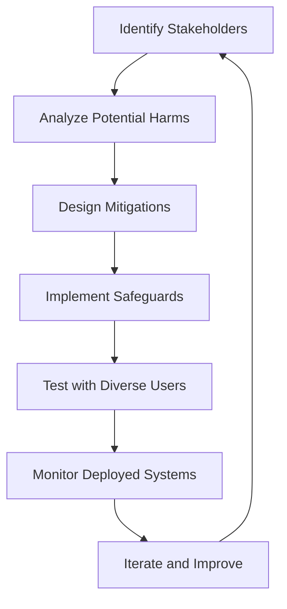

# Ethics and Society

import ChapterActions from '@site/src/components/ChapterActions';

<ChapterActions />

As robots become more capable and prevalent, we must grapple with profound ethical questions. This isn't just philosophy—these considerations will shape your engineering decisions.

## The Ethical Framework

### Why Ethics Matter in Robotics

Unlike software that stays in a computer, robots:
- Can physically affect the world
- Interact directly with vulnerable people
- Make split-second decisions with real consequences
- May operate autonomously for extended periods

```python
# The ethical consideration must be part of design
class EthicalRobot:
    def __init__(self):
        self.primary_directive = "Do no harm"
        self.ethical_checker = EthicalReasoningModule()
    
    def execute_action(self, action):
        # Every action gets ethical review
        if self.ethical_checker.is_harmful(action):
            return self.find_alternative(action)
        return action
```

### Foundational Principles

I follow these principles in robot design:

1. **Beneficence** - Robots should benefit humanity
2. **Non-maleficence** - Robots should not cause harm
3. **Autonomy** - Respect human agency and choice
4. **Justice** - Benefits and burdens distributed fairly
5. **Transparency** - Actions should be explainable

## Safety Considerations

### Asimov's Laws Revisited

Isaac Asimov's Three Laws are a starting point, but they're not sufficient:

**Original Laws:**
1. Don't harm humans or allow harm through inaction
2. Obey human commands (unless violates Law 1)  
3. Protect own existence (unless violates Laws 1-2)

**Problems:**
- What counts as "harm"? Psychological harm?
- What if two humans give conflicting commands?
- How to handle uncertainty about outcomes?
- Who is responsible when things go wrong?

### Modern Safety Standards

Today's robots follow specific safety standards:

| Standard | Scope |
|----------|-------|
| ISO 10218 | Industrial robot safety |
| ISO/TS 15066 | Collaborative robot safety |
| IEC 61508 | Functional safety |
| ISO 13849 | Safety-related control systems |

### Safety by Design

I always design with safety as a primary concern:

```python
class SafeRobot:
    def __init__(self):
        # Multiple layers of safety
        self.hardware_limits = HardwareSafetyLimits()
        self.software_watchdog = SoftwareWatchdog()
        self.human_detector = HumanProximityDetector()
        
    def move(self, target):
        # Check hardware limits
        if not self.hardware_limits.is_safe(target):
            return SafetyStop("Hardware limit exceeded")
            
        # Monitor for humans
        if self.human_detector.human_nearby():
            self.reduce_speed()
            
        # Execute with watchdog
        return self.software_watchdog.execute(
            lambda: self.actuator.move(target)
        )
```

## Job Displacement

This is perhaps the most pressing social concern.

### The Reality
- Robots WILL change the job market
- Some jobs will disappear
- New jobs will be created
- Transition will be difficult for many

### Historical Context
Every major technology has disrupted work:
- Agricultural machinery (90% → 2% in farming)
- Factory automation (manufacturing job decline)
- Computers (transformed office work)

But also created new opportunities each time.

### What's Different Now?
- Speed of change is faster
- AI can now do cognitive tasks
- Physical + cognitive automation combined
- Fewer "safe" job categories

### Responsible Development
As robotics engineers, we should:

1. **Consider impact** during design
2. **Support transition** programs
3. **Design for human-robot collaboration**
4. **Advocate for policies** that help displaced workers

## Privacy Concerns

Robots gather enormous amounts of data:

### Data Collection
- Cameras constantly recording
- Microphones listening
- Location tracking
- Personal routine learning

### Privacy-Preserving Design

```python
class PrivacyAwareRobot:
    def __init__(self):
        self.data_minimization = True
        self.local_processing = True
        
    def process_sensor_data(self, raw_data):
        # Only keep what's necessary
        if self.data_minimization:
            raw_data = self.strip_unnecessary(raw_data)
        
        # Process locally when possible
        if self.local_processing:
            return self.local_model.process(raw_data)
        
        # If cloud needed, anonymize first  
        anonymized = self.anonymize(raw_data)
        return self.cloud_api.process(anonymized)
```

### Best Practices
- **Minimal data collection** - Only what's needed
- **Local processing** - Don't send everything to cloud
- **Clear consent** - Users know what's collected
- **Data deletion** - Don't keep data forever
- **Security** - Protect collected data

## Bias and Fairness

AI systems can perpetuate or amplify biases:

### Types of Bias
- **Training data bias** - Unrepresentative datasets
- **Algorithm bias** - Design choices that favor groups
- **Interaction bias** - Different behavior toward groups

### Examples in Robotics
- Voice assistants understand some accents better
- Face recognition works better on some demographics
- Care robots tested mainly in specific cultures

### Mitigation Strategies

1. **Diverse datasets** - Represent all users
2. **Bias testing** - Explicitly check for disparities
3. **Diverse teams** - Different perspectives in design
4. **User feedback** - Listen to all affected groups

## Autonomous Weapons

A critical ethical boundary:

### The Concern
- Robots that can kill without human oversight
- Lowered barrier to starting conflicts
- Accountability gaps

### International Efforts
- **Campaign to Stop Killer Robots** - NGO coalition
- **UN discussions** - Ongoing negotiations
- **Corporate pledges** - Some companies refuse weapons work

### My Position
I believe in maintaining **meaningful human control** over all lethal decisions. This isn't just ethics—it's good engineering practice for accountability.

## Responsibility and Liability

When a robot causes harm, who's responsible?

### Stakeholders
- **Manufacturer** - Built the robot
- **Programmer** - Wrote the software
- **Operator** - Using the robot
- **Owner** - Owns the robot
- **Trainer** - Trained the ML models

### Legal Frameworks
Current law isn't well-suited for autonomous systems:
- Product liability for defects
- Negligence for operation
- But what about emergent behavior from learning?

### Design for Accountability

```python
class AccountableRobot:
    def __init__(self):
        self.action_logger = ActionLogger()  # Log everything
        self.decision_explainer = Explainer()  # Why did it decide this?
        
    def take_action(self, action, context):
        # Log the action and reasoning
        explanation = self.decision_explainer.explain(action, context)
        self.action_logger.log(action, explanation, context)
        
        # Execute
        return self.execute(action)
    
    def audit_trail(self, start_time, end_time):
        # Provide complete record for investigation
        return self.action_logger.get_logs(start_time, end_time)
```

## Human-Robot Relationships

As robots become more social:

### Emotional Attachment
- People bond with robots (even Roombas get names!)
- Could be therapeutic (companion robots)
- Could be problematic (replacing human relationships)

### Deception Concerns
- Robots that seem more intelligent than they are
- Emotional manipulation
- False sense of relationship

### Design Guidelines
1. **Be honest** about robot capabilities
2. **Don't exploit** emotional vulnerabilities
3. **Complement** human relationships, don't replace
4. **Consider** long-term psychological effects

## Building Ethical Robots

### Ethics by Design Process



### Checklist for Ethical Robot Development

- [ ] Identified all affected stakeholders
- [ ] Considered privacy implications
- [ ] Tested for bias across groups
- [ ] Implemented meaningful human control
- [ ] Created transparency/explainability
- [ ] Planned for accountability  
- [ ] Considered job impact
- [ ] Reviewed safety thoroughly

---

:::warning Remember
Technical excellence isn't enough. A brilliant robot that causes harm is a failure. Ethics must be integrated into every stage of development.
:::

## Practice Questions

1. What are the limitations of Asimov's Three Laws for real robots?
2. How can we design robots that respect user privacy?
3. What does "meaningful human control" mean in autonomous systems?
4. Who should be liable when a learning robot causes unexpected harm?

---

**Next Chapter:** [Foundations: Math & Programming →](../chapter-02-foundations/)
