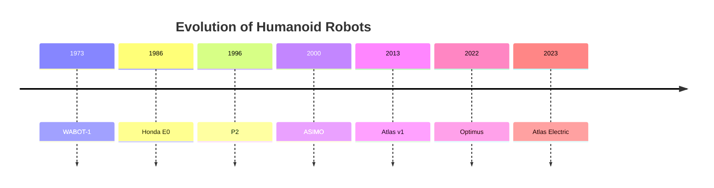

# History and Evolution of Robotics

import ChapterActions from '@site/src/components/ChapterActions';

<ChapterActions />

The dream of creating artificial beings is as old as humanity itself. Let me take you on a journey through time, from ancient myths to modern marvels.

## Ancient Dreams (Before 1900)

### Mythological Automata
Every culture has stories of artificial beings:
- **Talos** (Greek) - Bronze giant that protected Crete
- **Golem** (Jewish) - Clay figure brought to life
- **Yan Shi's automaton** (Chinese) - Mechanical man from 10th century BC

### Early Mechanical Wonders
Real automation began earlier than you might think:

- **1495**: Leonardo da Vinci designs a mechanical knight
- **1738**: Jacques de Vaucanson creates the "Digesting Duck"
- **1770**: Pierre Jaquet-Droz builds "The Writer" - a programmable automaton

```
Fun fact: da Vinci's robot knight could sit, stand, and raise 
its visor. The design was validated in 2002 when roboticist 
Mark Rosheim built a working replica!
```

## The Birth of Modern Robotics (1900-1960)

### The Word "Robot" is Born
In 1920, Czech playwright Karel Čapek introduced the word **"robot"** in his play *R.U.R. (Rossum's Universal Robots)*. It comes from the Czech word *robota*, meaning forced labor.

### Key Milestones

| Year | Event | Significance |
|------|-------|--------------|
| 1942 | Asimov's Three Laws | Foundation of robot ethics |
| 1948 | Grey Walter's Tortoises | First autonomous robots |
| 1954 | Devol files robot patent | Basis for industrial robots |
| 1956 | Dartmouth Conference | AI is born as a field |

### Asimov's Three Laws of Robotics
Isaac Asimov proposed these rules that still influence robot design:

1. A robot may not harm a human or allow harm through inaction
2. A robot must obey humans (unless it conflicts with Law 1)
3. A robot must protect itself (unless it conflicts with Laws 1 or 2)

## Industrial Revolution (1960-1990)

### Unimate: The First Industrial Robot
In 1961, the Unimate robot started work at a GM plant. This massive arm:
- Weighed 1,800 kg
- Could lift 225 kg  
- Performed dangerous die-casting tasks
- Changed manufacturing forever

```python
# The basic control loop that powers industrial robots
def industrial_robot_cycle():
    while running:
        # Move to programmed position
        move_to(target_position)
        # Perform action (weld, pick, place)
        execute_task()
        # Wait for cycle time
        wait(cycle_time)
        # Repeat
```

### The Japanese Boom
Japan embraced robotics in the 1970s-80s:
- By 1990, Japan had 60% of the world's industrial robots
- Companies like Fanuc, Kawasaki, and Yaskawa emerged
- "Lights-out" manufacturing became possible

## The Humanoid Quest (1970-2000)

### Early Humanoids

**WABOT-1 (1973) - Japan**
- First full-scale humanoid
- Could walk slowly
- Had primitive vision and speech

**P2 and P3 (1996-1997) - Honda**
- Major leap in bipedal walking
- Could climb stairs
- 210 cm tall, 130 kg

### ASIMO (2000)
Honda's ASIMO became the face of humanoid robotics:
- 130 cm tall, 54 kg
- Could run at 6 km/h
- Wave, shake hands, carry trays
- Though impressive, was ultimately more demonstration than practical

## The AI Revolution (2000-2020)

### Key Technological Breakthroughs

**Deep Learning (2012)**
AlexNet's victory in image recognition opened the floodgates:
- Robots could suddenly "see" much better
- Natural language processing improved dramatically
- Learning from demonstration became practical

**Boston Dynamics**
Founded in 1992, they became YouTube famous:
- **BigDog** (2005) - Scary quadruped
- **Atlas** (2013) - Humanoid that does parkour
- **Spot** (2020) - Commercially available quadruped



## The Current Era (2020-Present)

### The Humanoid Race
We're now in a "space race" for humanoid robots:

**Tesla Optimus (2022-)**
- Elon Musk's ambitious project
- Goals: $20,000 humanoid for every home
- Leveraging Tesla's AI expertise

**Figure AI (2023-)**
- Well-funded startup ($70M+ raised)
- Focus on general-purpose humanoids
- Partnership with OpenAI for AI capabilities

**1X Technologies (NEO)**
- Backed by OpenAI
- Focus on safe, everyday robots
- Impressive whole-body control

### What Changed?

Why the sudden explosion? Several factors converged:

1. **Compute Power** - GPUs make real-time AI possible
2. **Foundation Models** - LLMs provide reasoning and language
3. **Better Sensors** - Cheap, high-quality cameras and LIDAR
4. **Investment** - Billions flowing into the field
5. **Manufacturing** - Supply chains for EVs help robots

## Lessons from History

Looking back, I notice important patterns:

### What Works
- Solving specific problems (industrial robots)
- Patient, long-term R&D (Boston Dynamics)
- Building on previous advances

### What Doesn't Work
- Overselling capabilities
- Ignoring safety and reliability
- Trying to skip fundamental research

### The Hype Cycle
Robotics has gone through multiple hype cycles:
- 1980s: "Robots will take all jobs!"
- 2000s: "ASIMO will be in every home!"
- 2020s: "Humanoids will be everywhere by 2025!"

Reality is always more nuanced. Progress is real, but slower than hype suggests.

---

:::tip Historical Perspective
Understanding history helps you avoid repeating mistakes and identify real opportunities. Many "new" ideas in robotics are actually old ideas with better technology!
:::

## Key Takeaways

1. Humans have dreamed of creating artificial beings for millennia
2. Practical robotics began with industrial applications
3. Humanoid robots have been "5 years away" for decades
4. Recent AI advances are genuinely changing what's possible
5. We're in a new golden age of robotics development

## Practice Questions

1. What does the word "robot" literally mean, and where did it come from?
2. What was significant about the Unimate robot?
3. List three factors that enabled the current surge in humanoid robotics.
4. Why did Japan dominate industrial robotics in the 1980s?

---

**Next:** [AI Types and Approaches →](./ai-types-and-approaches)
