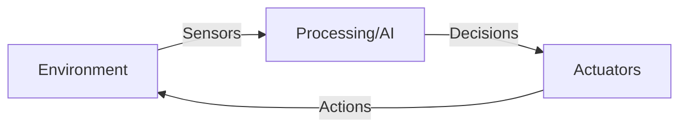

# Chapter 1: Introduction to Robotics and AI

import ChapterActions from '@site/src/components/ChapterActions';

<ChapterActions />

Welcome to the fascinating world where machines come alive! In this chapter, I'll take you through the journey of robotics—from ancient dreams of mechanical beings to today's AI-powered humanoids.

## What is a Robot?

Let me start with a definition that actually makes sense:

> **A robot is a programmable machine that can sense its environment, make decisions, and take physical actions to achieve goals.**

This definition has three key components:

1. **Sensing** - Robots perceive the world through sensors (cameras, LIDAR, touch sensors)
2. **Thinking** - They process information and make decisions (this is where AI comes in)
3. **Acting** - They affect the physical world through actuators (motors, grippers)



## Types of Robots

Robots come in many forms. Here's how I categorize them:

### Industrial Robots
- Fixed location, repetitive tasks
- Examples: Welding arms, pick-and-place machines
- Dominate manufacturing since the 1960s

### Mobile Robots
- Move through their environment
- Examples: Autonomous vehicles, drones, warehouse robots
- Use wheels, tracks, or legs

### Service Robots  
- Help humans with daily tasks
- Examples: Vacuum robots (Roomba), delivery bots
- Fastest growing segment

### Humanoid Robots
- Human-like form and movement
- Examples: Atlas, Optimus, Digit
- The focus of this textbook!

## What is Physical AI?

**Physical AI** is the intersection of artificial intelligence and physical embodiment. It's AI that:

- Exists in the real world, not just on servers
- Must deal with physics, friction, and uncertainty
- Learns from physical interaction
- Includes robotics, but also drones, autonomous vehicles, and smart devices

```python
# A simple way I think about it
class PhysicalAI:
    def __init__(self):
        self.body = RobotBody()       # Physical presence
        self.brain = AIModel()         # Intelligence
        self.sensors = SensorArray()   # Perception
        
    def act(self, environment):
        perception = self.sensors.observe(environment)
        decision = self.brain.think(perception)
        return self.body.execute(decision)
```

## Why Humanoid Robots?

You might wonder: why build robots that look like humans? Great question! Here are my reasons:

### 1. Human-Designed World
Our world is built for human bodies:
- Doors, stairs, tools, vehicles
- A humanoid can use existing infrastructure
- No need to redesign factories or homes

### 2. Human Interaction
- Humans relate better to human-like forms
- Natural communication (gestures, positioning)
- Intuitive collaboration

### 3. Versatility
- Two arms = manipulation capabilities
- Two legs = navigate any terrain humans can
- Hands = use human tools

### 4. The Ultimate Challenge
- Most complex robotic system to build
- Requires mastery of ALL robotics disciplines
- Pushing the boundaries of AI and control

## Current State of the Art

Let's look at where we are today:

| Robot | Company | Capabilities | Status |
|-------|---------|--------------|--------|
| Atlas | Boston Dynamics | Parkour, manipulation | Research |
| Optimus | Tesla | Walking, simple tasks | Development |
| Digit | Agility Robotics | Logistics, stairs | Commercial |
| Figure 01 | Figure AI | General purpose | Development |
| Phoenix | Sanctuary AI | Dexterous manipulation | Commercial |

## Key Challenges

Building humanoid robots is **hard**. Here's what makes it challenging:

### Balance and Locomotion
- Bipedal walking is inherently unstable
- Must constantly adjust to stay upright
- Walking on uneven terrain? Even harder

### Power and Energy
- Human-sized robots need lots of energy
- Batteries are heavy and limited
- Heat dissipation is a real problem

### Dexterity
- Human hands have 27 degrees of freedom
- Replicating fine motor control is extremely difficult
- Manipulating soft or deformable objects is unsolved

### Real-time AI
- Must process sensor data instantly
- Make decisions in milliseconds
- Adapt to unexpected situations

## What's Coming Next

In this chapter, we'll explore:

1. **[History and Evolution](./history-evolution)** - From ancient automata to modern robots
2. **[AI Types and Approaches](./ai-types-and-approaches)** - Understanding the brain of robots
3. **[Robot Classifications](./robot-classifications)** - A deeper taxonomy
4. **[Ethics and Society](./ethics-and-society)** - The implications of physical AI

---

:::info Chapter Summary
- Robots sense, think, and act in the physical world
- Physical AI combines intelligence with physical embodiment  
- Humanoid robots are the ultimate robotic challenge
- The field is advancing rapidly, creating huge opportunities
:::

## Practice Questions

1. What are the three key components of a robot according to our definition?
2. Why might a company choose a humanoid form factor over a wheeled robot?
3. Name three challenges specific to bipedal locomotion.
4. What is the difference between "AI" and "Physical AI"?

---

**Next:** [History and Evolution →](./history-evolution)
