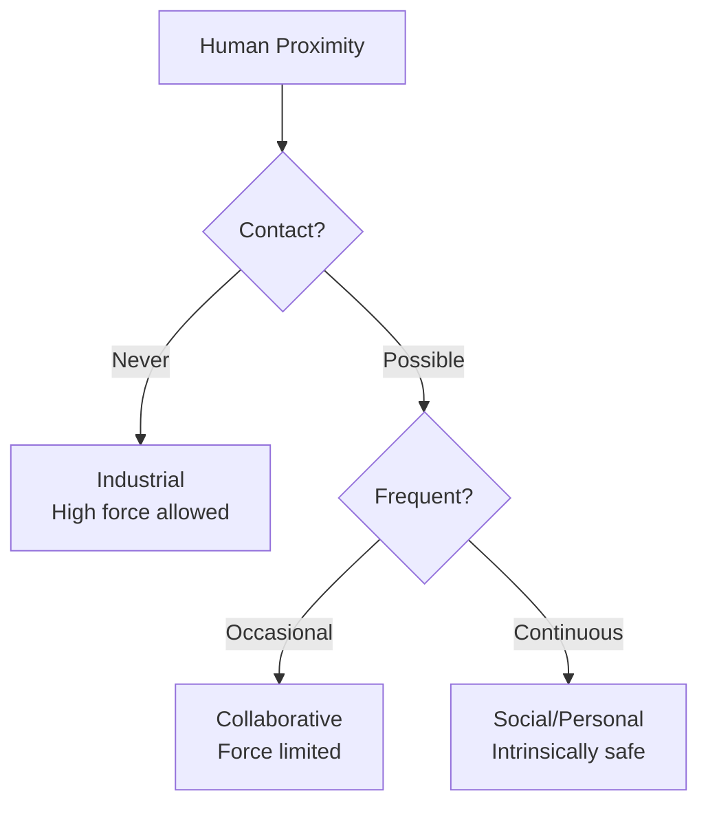

# Robot Classifications

import ChapterActions from '@site/src/components/ChapterActions';

<ChapterActions />

Robots come in countless forms, each optimized for specific tasks. Let me give you a comprehensive taxonomy to understand the landscape.

## Classification by Mobility

### Fixed/Stationary Robots
These robots stay in one place but can still move their arms:

- **Industrial Arms** - Welding, assembly, painting
- **CNC Machines** - Precision manufacturing  
- **3D Printers** - Additive manufacturing

```
Workspace: Limited to arm reach
Repeatability: Very high (±0.01mm possible)
Payload: Can be very high (100s of kg)
```

### Mobile Robots
Robots that can move through their environment:

#### Wheeled Robots
Most common mobile platform:
- **Differential Drive** - Two wheels, simple control
- **Omnidirectional** - Mecanum wheels, move any direction
- **Ackermann** - Car-like steering

```python
# Differential drive kinematics
def differential_drive(left_velocity, right_velocity, wheel_base):
    # Linear velocity (forward motion)
    v = (left_velocity + right_velocity) / 2
    
    # Angular velocity (rotation)
    omega = (right_velocity - left_velocity) / wheel_base
    
    return v, omega
```

#### Legged Robots
Can traverse rough terrain:
- **Biped** - Two legs (humanoids)
- **Quadruped** - Four legs (Spot, ANYmal)
- **Hexapod** - Six legs (very stable)

#### Flying Robots (Drones)
Aerial platforms:
- **Quadrotors** - Most common, agile
- **Fixed-wing** - Long range, efficient
- **VTOL** - Vertical takeoff + fixed-wing flight

### Aquatic Robots
Operate in water:
- **AUVs** - Autonomous underwater vehicles
- **ROVs** - Remotely operated (tethered)
- **Surface vessels** - Autonomous boats

## Classification by Application

### Industrial Robots 
According to ISO 8373 standards:

| Type | Description | Example Tasks |
|------|-------------|---------------|
| Articulated | 6+ rotary joints | Welding, assembly |
| SCARA | Fast, 4-axis | Pick and place |
| Cartesian | Linear axes | CNC, 3D printing |
| Delta | Parallel linkage | Fast packaging |
| Collaborative | Works alongside humans | Assembly assist |

### Service Robots

#### Professional Service Robots
- Medical (surgical robots, rehab)
- Agriculture (harvesting, spraying)
- Logistics (warehouse automation)
- Construction (demolition, 3D printing)
- Defense (EOD, surveillance)

#### Personal Service Robots  
- Domestic (vacuum, lawn mowing)
- Entertainment (toys, companions)
- Elderly care (assistance, monitoring)
- Education (teaching aids)

### Research Robots
Designed for experimentation:
- Humanoids (Atlas, iCub)
- Manipulation platforms (Franka Emika)
- Mobile platforms (TurtleBot)

## Classification by Intelligence Level

I think of robot intelligence on a spectrum:

### Level 1: Pre-programmed
- Fixed sequence of actions
- No sensing or adaptation
- Example: Simple assembly line robots

### Level 2: Reactive
- Responds to sensor input
- No memory or learning
- Example: Roomba (basic)

### Level 3: Model-based
- Has internal model of world
- Plans actions
- Example: Autonomous vehicles

### Level 4: Learning  
- Improves from experience
- Adapts to new situations
- Example: Modern manipulation robots

### Level 5: Cognitive
- Reasoning, understanding
- General intelligence
- Example: Future goal (not achieved yet)

```python
# Classification by intelligence
class RobotIntelligenceLevel:
    PRE_PROGRAMMED = 1  # Fixed behavior
    REACTIVE = 2        # Sense -> Act
    MODEL_BASED = 3     # Sense -> Plan -> Act
    LEARNING = 4        # Can improve
    COGNITIVE = 5       # True understanding
```

## Classification by Human Interaction

### Industrial (Caged)
- Separated from humans by barriers
- High speed, high force
- No safety requirements for contact

### Collaborative (Cobots)
- Work alongside humans
- Force and speed limited
- Must detect and respond to contact

### Personal/Social
- Direct human interaction
- Natural communication
- Must be intrinsically safe



## Humanoid Robot Classification

Since we're focused on humanoids, let me break them down:

### By Size
- **Full-size** (150-180 cm) - Atlas, Optimus
- **Child-size** (100-130 cm) - ASIMO, Pepper
- **Desktop** (30-50 cm) - NAO, Darwin

### By Capability
- **Research platforms** - Flexible, expensive, limited production
- **Commercial** - Specific task, production-ready
- **Demonstration** - Showcasing technology

### By Actuation
- **Electric** - Quiet, precise, energy efficient
- **Hydraulic** - Powerful, heavy, loud
- **Pneumatic** - Lightweight, compliant, less precise

### By Dexterity
- **Limited** - Simple grippers (2-3 DOF)
- **Moderate** - Multi-finger hands (10-15 DOF)
- **Human-like** - Full dexterity (20+ DOF)

## The Humanoid Landscape Today

Here's my map of current players:

```
Research ─────────────────────────────── Commercial
│                                           │
│  Atlas (BD)          Digit (Agility)     │
│  iCub                Phoenix (Sanctuary)  │
│                                           │
│  Optimus (Tesla) ───────→                │
│  Figure 01 ────────────→                 │
│  NEO (1X) ─────────────→                 │
│                                           │
Demonstration                               Production
```

## Choosing Robot Type for Applications

| Application | Recommended Type | Why |
|-------------|------------------|-----|
| Factory assembly | Industrial arm | Speed, precision |
| Warehouse logistics | Mobile manipulator | Flexibility |
| Home assistance | Humanoid | Human environment |
| Search and rescue | Quadruped | Terrain handling |
| Last-mile delivery | Wheeled | Efficiency |
| Surgery | Collaborative arm | Precision + safety |

---

:::tip Remember
The "best" robot type depends entirely on the application. Humanoids are exciting but aren't always the right choice—they're optimal when human-like form is genuinely needed.
:::

## Practice Questions

1. What are the main types of mobile robot locomotion?
2. What distinguishes a collaborative robot from an industrial robot?
3. Describe the five levels of robot intelligence.
4. Why might you choose a quadruped over a humanoid for some tasks?

---

**Next:** [Ethics and Society →](./ethics-and-society)
