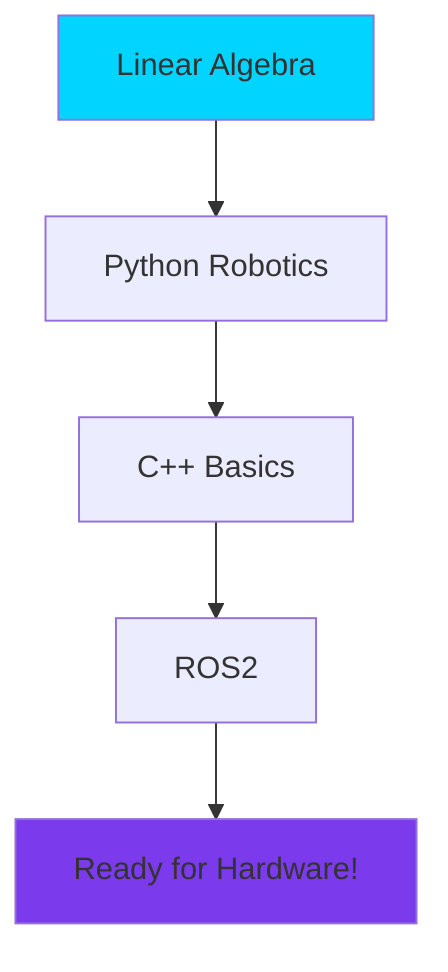

# Chapter 2: Foundations - Math & Programming

import ChapterActions from '@site/src/components/ChapterActions';

<ChapterActions />

Before we can build robots, we need the right tools. This chapter covers the mathematical foundations and programming skills essential for robotics.

## Why Math Matters

Every robot movement, every sensor reading, every AI decision is fundamentally mathematical:

- **Positions and orientations** → Linear algebra
- **Motion and forces** → Calculus and dynamics
- **Sensor uncertainty** → Probability and statistics
- **Control systems** → Differential equations

Don't worry—I'll make it practical and relevant!

## Chapter Overview

We'll cover four essential areas:

### [1. Linear Algebra for Robotics](./linear-algebra)
- Vectors and matrices
- Transformations and rotations
- Homogeneous coordinates
- Essential for describing robot pose and motion

### [2. Python for Robotics](./python-for-robotics)
- NumPy for numerical computing
- Core libraries: OpenCV, PyTorch
- Simulation with PyBullet
- The go-to language for AI and prototyping

### [3. C++ Basics](./cpp-basics)
- Why C++ for real-time systems
- Memory management essentials
- Common robotics patterns
- Used in production robotics code

### [4. ROS2 Introduction](./ros2-intro)
- Robot Operating System fundamentals
- Nodes, topics, and services
- Building your first robot application
- The standard platform for robotics

## Prerequisites Check

Before diving in, make sure you're comfortable with:

- [ ] Basic algebra (solving equations)
- [ ] Trigonometry (sin, cos, angles)
- [ ] Any programming language (loops, functions)
- [ ] Command line basics

If you're rusty, don't worry—I'll explain as we go!

## Setting Up Your Environment

You'll want to have these installed:

```bash
# Python environment
python --version  # Should be 3.10+
pip install numpy scipy matplotlib

# For later chapters
pip install opencv-python torch pybullet

# ROS2 (we'll cover installation in detail)
# See ros2-intro section for full setup
```

## Learning Path



---

:::tip Pro Tip
You don't need to master everything before moving on. Come back to review as needed—these foundations will click more as you apply them in later chapters!
:::

**Let's start with:** [Linear Algebra →](./linear-algebra)
