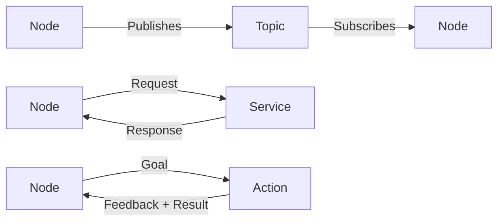

# ROS2 Introduction

import ChapterActions from '@site/src/components/ChapterActions';

<ChapterActions />

ROS2 (Robot Operating System 2) is the standard middleware for robotics. It handles communication, hardware abstraction, and provides a massive ecosystem of tools.

## What is ROS2?

ROS2 is NOT actually an operating system—it's a middleware framework that provides:

- **Communication** - Between processes and machines
- **Abstraction** - Hardware-independent interfaces
- **Tools** - Visualization, simulation, debugging
- **Ecosystem** - Thousands of packages

## Core Concepts



### Nodes
Independent processes that do specific tasks:
- Camera driver node
- Motor controller node
- Path planning node

### Topics
Publish-subscribe messaging for continuous data:
- `/camera/image` - Camera frames
- `/joint_states` - Robot joint positions
- `/cmd_vel` - Velocity commands

### Services
Request-response for occasional calls:
- `/spawn_robot` - Create a robot
- `/get_map` - Get navigation map

## Your First ROS2 Node

```python
import rclpy
from rclpy.node import Node
from geometry_msgs.msg import Twist

class SimpleRobot(Node):
    def __init__(self):
        super().__init__('simple_robot')
        
        # Publisher for velocity commands
        self.vel_pub = self.create_publisher(Twist, 'cmd_vel', 10)
        
        # Timer for control loop
        self.timer = self.create_timer(0.1, self.control_loop)
        self.get_logger().info('Robot started!')
    
    def control_loop(self):
        msg = Twist()
        msg.linear.x = 0.5   # Move forward
        msg.angular.z = 0.1  # Turn slightly
        self.vel_pub.publish(msg)

def main():
    rclpy.init()
    robot = SimpleRobot()
    rclpy.spin(robot)
    robot.destroy_node()
    rclpy.shutdown()

if __name__ == '__main__':
    main()
```

---

:::info ROS2 Distributions
Use ROS2 **Humble** (LTS) or **Jazzy** (latest). They have the best ecosystem support.
:::

**Next Chapter:** [Robot Hardware Systems →](../chapter-03-hardware/)
