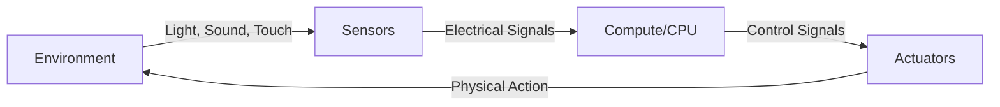

# Chapter 3: Robot Hardware Systems

import ChapterActions from '@site/src/components/ChapterActions';

<ChapterActions />

Software is useless without hardware to run it on. This chapter covers the physical components that make robots work.

## The Robot Body

Every robot has three core hardware systems:

1. **Sensors** - How it perceives the world
2. **Actuators** - How it moves and acts  
3. **Compute** - The brain that connects them

## In This Chapter

- [**Sensors**](./sensors) - Cameras, LIDAR, IMUs, encoders
- [**Actuators & Motors**](./actuators-motors) - Brushed, brushless, servos
- [**Microcontrollers**](./microcontrollers) - Arduino, Raspberry Pi, Jetson
- [**Power Systems**](./power-systems) - Batteries and power management

---

**Start with:** [Sensors →](./sensors)
