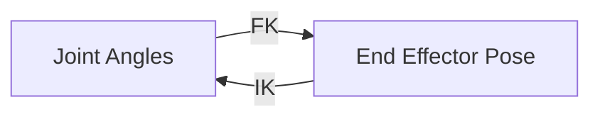

# Chapter 4: Kinematics & Dynamics

import ChapterActions from '@site/src/components/ChapterActions';

<ChapterActions />

Kinematics describes motion without forces. Dynamics includes forces. Together, they let us control robot movement precisely.

## Forward vs Inverse Kinematics

**Forward Kinematics (FK):** Given joint angles → Where is the end effector?
**Inverse Kinematics (IK):** Given target position → What joint angles needed?

## In This Chapter

- [**Forward Kinematics**](./forward-kinematics) - Computing positions from joints
- [**Inverse Kinematics**](./inverse-kinematics) - Computing joints from positions
- [**Dynamics**](./dynamics) - Forces and motion
- [**Simulation Tools**](./simulation-tools) - Gazebo, PyBullet, MuJoCo

---

**Start with:** [Forward Kinematics →](./forward-kinematics)
