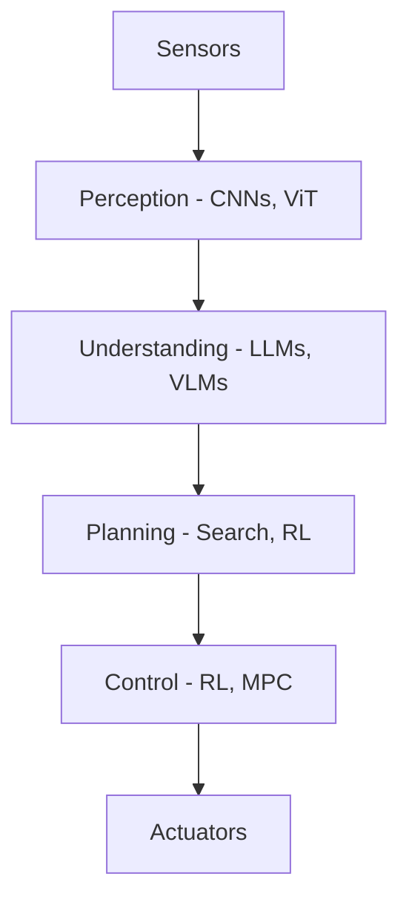

# Chapter 5: AI for Robotics

import ChapterActions from '@site/src/components/ChapterActions';

<ChapterActions />

AI is what makes robots intelligent. This chapter covers the machine learning techniques that power modern robots.

## The AI Stack for Robots

## In This Chapter

- [**Machine Learning Basics**](./machine-learning-basics) - Fundamentals
- [**Deep Learning**](./deep-learning) - Neural networks for perception
- [**Reinforcement Learning**](./reinforcement-learning) - Learning from interaction
- [**LLMs for Robots**](./llms-for-robots) - Language models in robotics

---

**Start with:** [Machine Learning Basics →](./machine-learning-basics)
