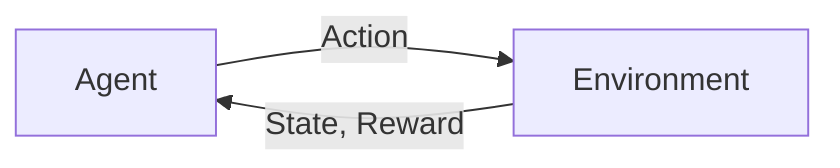

# Reinforcement Learning

import ChapterActions from '@site/src/components/ChapterActions';

<ChapterActions />

RL is perfect for robotics—agents learn by interacting with their environment.

## The RL Framework



## PPO: A Popular Algorithm

```python
# Pseudocode for PPO training loop
for epoch in range(num_epochs):
    # Collect trajectories
    states, actions, rewards = collect_rollout(policy, env)
    
    # Compute advantages
    advantages = compute_gae(rewards, values)
    
    # Update policy with clipping
    for batch in minibatches(states, actions, advantages):
        ratio = new_prob / old_prob
        clipped = torch.clamp(ratio, 1-eps, 1+eps)
        loss = -torch.min(ratio * adv, clipped * adv).mean()
        loss.backward()
        optimizer.step()
```

## Sim-to-Real Transfer

Train in simulation, deploy on real robot—the key challenge of robotic RL.

---

**Next:** [LLMs for Robots →](./llms-for-robots)
