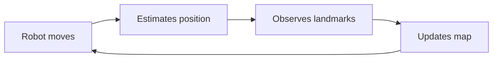

# SLAM

import ChapterActions from '@site/src/components/ChapterActions';

<ChapterActions />

Simultaneous Localization and Mapping — how robots map unknown environments while tracking their position.

## The SLAM Problem

## Popular SLAM Algorithms

| Algorithm | Sensor | Use Case |
|-----------|--------|----------|
| ORB-SLAM3 | Camera | Visual SLAM |
| Cartographer | LIDAR | 2D/3D mapping |
| RTAB-Map | RGB-D | Dense 3D |

---

**Next:** [Human-Robot Interaction →](./human-robot-interaction)
