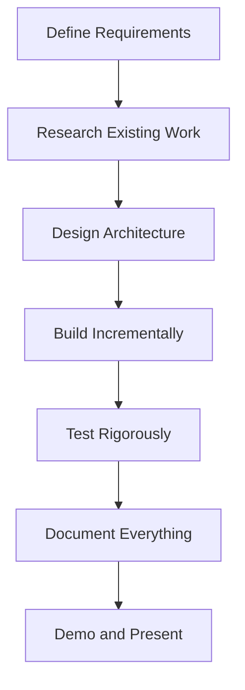

# Implementation Guide

import ChapterActions from '@site/src/components/ChapterActions';

<ChapterActions />

A systematic approach to completing your capstone project.

## The Process

## Week-by-Week Guide

### Week 1-2: Planning
- Define what you want to build
- List required components
- Create a timeline

### Week 3-4: Foundation  
- Set up development environment
- Get basic hardware working
- Test individual components

### Week 5-6: Core Development
- Integrate components
- Implement main functionality
- Continuous testing

### Week 7-8: Polish
- Handle edge cases
- Optimize performance
- Prepare documentation

## Tips for Success

1. **Start simple** - Get something working first
2. **Test early** - Don't wait until the end
3. **Document as you go** - You'll thank yourself later
4. **Ask for help** - Use the AI chatbot below!

---

**Next:** [Resources →](./resources)
